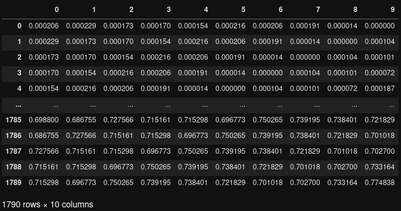

  

# Bitcoin time series forecasting

This dataset1 contains 10 days worth of data to experiment with building a simple a time-series forecast of Bitcoin values.

The data can be used to build and train an [LSTM](https://en.wikipedia.org/wiki/Long_short-term_memory)model that can do regression using time-series forecasting techniques.

# Structure

This repo contains the following structure:

- **BT-USD-TimeSeries.csv**: CSV file with time-series data of Bitcoin.

The following shows a partial example of the data stored in **BT-USD-TimeSeries.csv* that is used to load the data into PerceptiLabs. Each column contains data for a day, and last column is the target. All values are normalized between 0 and 1 which is a requirement for LSTM layers.

  

# Community

Got questions, feedback, or want to join a community of machine learning practitioners working with exciting tools and projects? Check out our [Community](https://forum.perceptilabs.com/)!

1 Dataset Credits: https://finance.yahoo.com/quote/BTC-USD/history/
